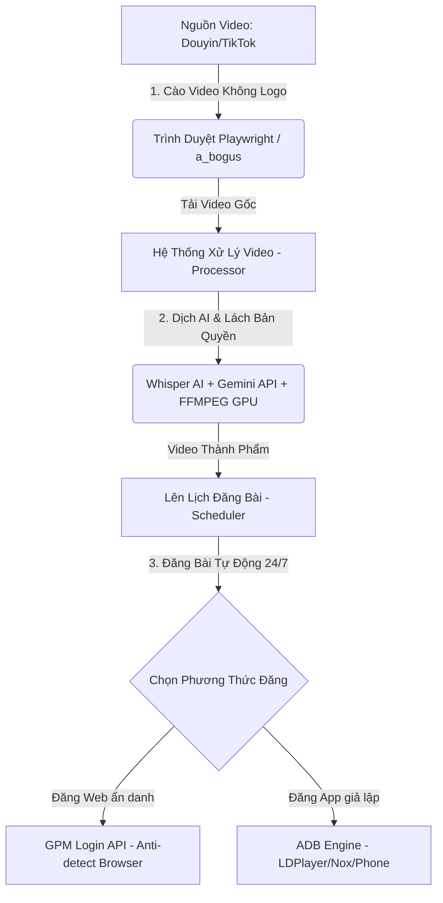

# 📖 CẨM NANG SỬ DỤNG & CÀI ĐẶT HỆ THỐNG AUTO RE-UP TIKTOK / DOUYIN
*(Hệ Thống Tự Động Hóa Xây Dựng Kênh Video Ngắn Toàn Diện - Phiên Bản Nâng Cấp Premium)*

[](LICENSE)

---

## 🚀 1. TỔNG QUAN HỆ THỐNG

Dự án **Auto Re-up TikTok / Douyin** là giải pháp tự động hóa 100% quy trình xây dựng và phát triển hệ thống kênh video ngắn vệ tinh (TikTok, Douyin, YouTube Shorts, Facebook Reels). Hệ thống thay thế hoàn toàn một đội ngũ biên tập video và đăng bài thủ công bằng cách tích hợp trí tuệ nhân tạo (AI) và các giao thức tự động hóa trình duyệt/giả lập.



### 🎨 Thiết Kế Giao Diện Premium (UI/UX)
Hệ thống được lột xác hoàn toàn diện mạo mới theo phong cách **Glassmorphism kết hợp Cyberpunk Dark Mode**:
*   **Bảng màu hiện đại:** Sử dụng nền tối sâu thẳm (`#0d1117`, `#161b22`) làm nổi bật các dải màu gradient Neon (Tím huyền ảo, xanh cyan điện tử, hồng neon).
*   **Lớp kính mờ (Glassmorphism):** Áp dụng hiệu ứng `.glass-panel` (`backdrop-blur`, nền bán trong suốt và viền mờ phát sáng) tạo cảm giác cực kỳ cao cấp.
*   **Tương tác mượt mà:** Tích hợp `framer-motion` cho các chuyển động hover, hiệu ứng xuất hiện (entrance fade-in) và chuyển đổi mượt mà đạt tốc độ hiển thị 60fps.

---

## 📂 2. CẤU TRÚC DỰ ÁN (PROJECT ARCHITECTURE)

Hệ thống được tổ chức theo cấu trúc module hóa phân tầng rõ ràng, tách bạch giữa Backend, Frontend, Remote GPU, Scripts vận hành và Tài liệu kỹ thuật:

```text
auto_reup/
├── .agent/                      # Cấu hình AI Agent Antigravity (Skills, Rules, Workflows)
├── backend/                     # Dịch vụ Backend FastAPI & Celery Worker
│   ├── app/                     # Mã nguồn chính (api, core, db, models, services, tasks)
│   ├── tests/                   # Toàn bộ Unit & Integration tests của Backend
│   ├── Dockerfile               # Cấu hình container Backend
│   ├── main.py                  # Entrypoint ứng dụng FastAPI
│   └── requirements.txt         # Thư viện Python phụ thuộc
├── frontend/                    # Giao diện quản trị Web UI (React + Vite + Tailwind)
│   ├── src/                     # Mã nguồn React components & pages
│   ├── index.html & vite.config # Cấu hình Vite build
│   └── package.json             # Dependencies Frontend
├── colab_hybrid/                # Module tích hợp GPU đám mây (Google Colab Server & Client)
├── local_agent/                 # Tiện ích Desktop hỗ trợ đăng nhập TikTok & quản lý phiên
├── docs/                        # Toàn bộ tài liệu hệ thống (Xem docs/README.md)
│   ├── architecture/            # Thiết kế kiến trúc & luồng dữ liệu
│   ├── guides/                  # Cẩm nang hướng dẫn cài đặt & vận hành
│   ├── phases/                  # Đặc tả kỹ thuật các Phase phát triển
│   └── tasks/                   # Nhiệm vụ, kế hoạch & ghi chú nghiên cứu
├── logs/                        # Thư mục lưu trữ nhật ký hoạt động (bot.log, celery.log)
├── scripts/                     # Kịch bản tiện ích vận hành & kiểm thử
│   ├── adb/                     # Kiểm thử ADB điện thoại & giả lập
│   ├── database/                # Tiện ích tra cứu & tối ưu database
│   └── debug/                   # Script phân tích & debug hình ảnh/video
├── data/                        # Dữ liệu runtime (DB SQLite/Postgres, video, cookies)
├── docker-compose.yml           # Khởi chạy Docker services (Postgres, Redis, Frontend, 9router)
├── start_backend.bat            # Script 1-click khởi chạy Backend & Celery native trên Windows
├── README.md                    # Cẩm nang tổng quan hệ thống & Quickstart
├── SETUP_GUIDE.md               # Hướng dẫn cài đặt A-Z chi tiết
├── ERRORS.md                    # Nhật ký theo dõi lỗi tự học
└── GEMINI.md                    # Định danh & quy tắc AI Agent Antigravity
```

> 📖 Chi tiết tài liệu kỹ thuật của từng module, vui lòng tham khảo [Mục lục Tài liệu](file:///docs/README.md).

---

## ⚡ 3. CÁC TÍNH NĂNG NỔI BẬT

*   **🕷️ Crawler Siêu Việt:** Hỗ trợ cào video đơn lẻ hoặc quét toàn bộ Profile Douyin/TikTok. Tích hợp thuật toán sinh mã `a_bogus` và tự vượt rào Captcha bằng trình duyệt ngầm Playwright để lấy Cookie mới.
*   **🎬 Render Video Lách Bản Quyền:** Tự động lật gương (Mirror), zoom nhẹ, điều chỉnh tốc độ, chỉnh cân bằng màu và khử nhiễu.
*   **📝 Dịch Thuật & Tạo Phụ Đề AI:** Sử dụng AI Whisper (hoặc Groq Whisper siêu tốc) để nhận diện giọng nói tiếng Trung/Anh, dịch sang tiếng Việt bằng Gemini AI và in thẳng phụ đề cứng lên video.
*   **🎙️ Chuyển Văn Bản Thành Giọng Nói (TTS):** Tích hợp Edge-TTS, FPT.AI, ElevenLabs để lồng tiếng thuyết minh chuyên nghiệp.
*   **🖼️ Cá Nhân Hóa Font Chữ & Watermark:** Hỗ trợ chèn logo thương hiệu. Tự động nhận diện các font chữ tùy chỉnh (`.ttf`, `.otf`) được copy vào thư mục `data/fonts`.
*   **🤖 Đăng Bài Đa Phương Thức:**
    *   **GPM Login:** Điều khiển trình duyệt ẩn danh (Anti-detect Browser) để đăng video qua web an toàn, hạn chế tối đa quét bot.
    *   **ADB Engine:** Tự động kết nối, điều khiển điện thoại thật hoặc máy giả lập (LDPlayer, Nox...) để đăng bài trực tiếp trên app.
*   **📱 Nuôi Tài Khoản Tự Động (Warmup Engine):** Tự động lướt TikTok tương tác như người dùng thật, sử dụng AI Vision để phát hiện icon Tym 🤍 và tự động tương tác tăng độ tin cậy cho tài khoản.

---

## 🛠️ 4. YÊU CẦU HỆ THỐNG & CÀI ĐẶT

### 📌 Yêu Cầu Chuẩn Bị
*   **Hệ điều hành:** Khuyên dùng Windows 10/11 (hỗ trợ tốt nhất cho các phần mềm giả lập và GPM Login).
*   **Docker Desktop:** Bắt buộc để khởi chạy toàn bộ dịch vụ (Backend, Frontend, DB, Redis, Celery).
*   **GPM Login (Tùy chọn):** Nếu bạn muốn sử dụng phương thức đăng bài qua trình duyệt ẩn danh.
*   **LDPlayer / NoxPlayer (Tùy chọn):** Nếu bạn muốn đăng bài qua app giả lập và sử dụng tính năng nuôi tài khoản.
*   **Gemini API Key:** (Bắt buộc) Dùng để dịch phụ đề và viết Caption thông minh (Lấy miễn phí tại Google AI Studio).

### ⚙️ Quy Trình Cài Đặt Qua Docker

1.  **Tải mã nguồn:**
    ```bash
    git clone <url_repository_github>
    cd auto_reup
    ```
2.  **Khởi chạy hệ thống:**
    Mở Docker Desktop, sau đó chạy lệnh:
    ```bash
    docker-compose up -d --build
    ```
    *(Hệ thống sẽ tự động kéo các image cần thiết, cài đặt thư viện và thiết lập môi trường).*
3.  **Truy cập giao diện quản trị:**
    Mở trình duyệt và truy cập: 👉 **http://localhost:5173**

---

## 📚 5. HƯỚNG DẪN SỬ DỤNG CHI TIẾT (STEP-BY-STEP)

Hệ thống điều hướng chính được tối ưu hóa, chia thành 3 nhóm danh mục rõ ràng trên Sidebar:

### BƯỚC 1: CẤU HÌNH BAN ĐẦU (Tab Cấu hình)
*   Truy cập **Cấu hình (Settings)** (Nhóm **Cấu hình & Kết nối**).
*   Form cài đặt được chia thành các tab con thông minh:
    1.  **🔑 API & AI Keys:** Điền Gemini API Key, Groq API Key (nếu muốn dùng Whisper siêu tốc).
    2.  **🎙️ Giọng Nói (TTS):** Chọn nhà cung cấp giọng đọc mặc định (Edge-TTS, FPT.AI, ElevenLabs).
    3.  **🌐 Trình Duyệt & Proxy:** Điền đường dẫn API của GPM Login (Thường là `http://127.0.0.1:19995`).
    4.  **🖥️ Tăng Tốc & Giám Sát:** Bật/tắt tăng tốc phần cứng GPU (Intel QSV / Nvidia NVENC).
*   Bấm **Lưu cấu hình** để lưu các thiết lập trực tiếp vào file `.env`.

### BƯỚC 2: QUẢN LÝ TÀI KHOẢN MXH (Tab Tài khoản MXH)
*   Vào mục **Tài khoản MXH** để thêm các tài khoản vệ tinh.
*   Chọn phương thức đăng bài:
    *   **Nếu chọn GPM:** Hãy mở GPM Login lên, tạo Profile, đăng nhập sẵn tài khoản TikTok/YouTube. Sau đó copy **Profile ID** điền vào form trên web.
    *   **Nếu chọn ADB:** Bật chế độ ADB trên điện thoại hoặc giả lập. Chạy lệnh `adb devices` trong CMD của máy tính để lấy **Device ID** (Ví dụ `emulator-5554` hoặc `host.docker.internal:5555`) và nhập vào hệ thống.

### BƯỚC 3: CÀO VIDEO (Tab Cào Video)
*   Giao diện được thiết kế dạng **2 cột (Split Screen Layout)**:
    *   **Cột Trái (Điều khiển):** Nhập URL Profile hoặc URL Video cụ thể cần cào. Nhấn **Bắt đầu cào**.
    *   **Cột Phải (Live Console):** Cửa sổ terminal hiển thị trực tiếp log hoạt động của script cào video theo thời gian thực.
*   Video cào về sẽ nằm trong thư mục lưu trữ cục bộ và hiển thị trong danh sách **Lịch sử**.

### BƯỚC 4: XỬ LÝ & RENDER LÁCH BẢN QUYỀN (Tab Lịch sử)
*   Trong mục **Lịch sử**, nhấn biểu tượng **Play (Cấu hình & Xử lý)** trên video bạn muốn edit.
*   Giao diện xử lý gồm 2 cột:
    *   **Cột Trái (Cấu hình):** Chứa các tab cấu hình chi tiết:
        *   *Nguồn & Giọng đọc:* Chọn tệp, chọn giọng đọc thuyết minh.
        *   *Phụ đề:* Chọn font chữ, cỡ chữ, màu sắc chữ phụ đề hiển thị.
        *   *Watermark:* Điều chỉnh tọa độ X/Y, độ mờ (Opacity) và tải lên file logo.
        *   *Hiệu ứng:* Tùy chọn lật gương, zoom, chỉnh tốc độ video, tinh chỉnh pitch âm thanh.
    *   **Cột Phải (Tiến trình & Preview):** Hiển thị thanh tiến trình render, cửa sổ log FFMPEG thời gian thực và khung preview giả lập để căn chỉnh vị trí logo/chữ ký.
*   Bấm **Bắt đầu xử lý** để hệ thống render ra video thành phẩm.

### BƯỚC 5: LÊN LỊCH ĐĂNG BÀI TỰ ĐỘNG (Tab Lịch Đăng Bài)
*   Chọn video đã render thành công từ danh sách.
*   Chọn danh sách các tài khoản muốn đăng bài lên (Hỗ trợ tích chọn hàng loạt tài khoản).
*   Nhấn nút **Tự viết bằng AI**: Gemini AI sẽ tự động phân tích ngữ cảnh video để soạn thảo nội dung Caption cực kỳ giật tít thu hút người xem cùng 5 hashtag đang thịnh hành.
*   Chọn khung giờ đăng bài (Hẹn giờ hoặc đăng ngay lập tức).
*   Nhấn **Xác nhận lên lịch**. Celery Beat chạy ngầm sẽ tự động kích hoạt tiến trình đăng video đúng giờ đã hẹn.

### BƯỚC 6: NUÔI TÀI KHOẢN (Tab Nuôi Tài Khoản)
*   (Áp dụng cho giả lập/điện thoại ADB) Thiết lập thời gian lướt TikTok tự động.
*   Hệ thống sẽ điều khiển thiết bị lướt ngẫu nhiên, xem video, tự thả tim bằng AI Vision giúp tài khoản tăng độ uy tín (trust score), tránh bị TikTok đánh giá là tài khoản clone spam.

---

## ⚠️ 6. XỬ LÝ SỰ CỐ THƯỜNG GẶP (TROUBLESHOOTING)

> [!WARNING]
> ### 1. Lỗi Không Thể Kết Nối ADB Trong Docker
> Vì hệ thống backend chạy bên trong môi trường Docker bị cô lập, lệnh `adb` mặc định sẽ không thấy được giả lập chạy trực tiếp trên Windows.
> *   **Giải pháp:** Trong ô nhập **ADB Device ID** trên giao diện web, thay vì nhập `emulator-5554`, bạn phải nhập địa chỉ IP Host nội bộ: `host.docker.internal:5555` (hoặc cổng tương ứng của giả lập). Backend sẽ tự động thực hiện lệnh `adb connect` để kết nối xuyên qua container.

> [!IMPORTANT]
> ### 2. Lỗi Cơ Sở Dữ Liệu Sau Khi Cập Nhật Code (Database Schema Mismatch)
> Khi bạn kéo code mới từ Github (`git pull`), cấu trúc database có thể đã thay đổi (thêm bảng, thêm cột). Nếu chạy docker trực tiếp, backend có thể bị crash hoặc lỗi SQL.
> *   **Giải pháp (Làm mới DB):** Chạy tổ hợp lệnh sau để xóa các ổ đĩa cũ bị lỗi thời và khởi tạo lại cấu trúc dữ liệu mới nhất:
>     ```bash
>     docker-compose down -v
>     docker-compose up -d --build
>     ```
>     *(Lưu ý: Lệnh này sẽ dọn dẹp các volume dữ liệu cũ của postgres để build lại chuẩn xác).*

> [!TIP]
> ### 3. Lỗi Cập Nhật Code Nhưng Chạy Không Lên Thư Viện Mới
> Docker có xu hướng sử dụng lại cache cũ khi build lại. Nếu file `requirements.txt` có thư viện mới, docker-compose up thông thường có thể bỏ sót.
> *   **Giải pháp:** Luôn sử dụng cờ `--build` khi khởi chạy lại sau khi pull code:
>     ```bash
>     docker-compose down
>     docker-compose up -d --build
>     ```

> [!NOTE]
> ### 4. Cách Thêm Font Chữ Tự Chọn Cho Phụ Đề
> Bạn không cần phải sửa code hay cài đặt font vào hệ điều hành của Docker.
> *   **Giải pháp:** Hãy copy trực tiếp các file font chữ `.ttf` hoặc `.otf` vào thư mục `data/fonts/` trong dự án. F5 lại giao diện web, hệ thống sẽ tự động quét và thêm tên font đó vào danh sách lựa chọn trong cấu hình phụ đề/watermark.

---

## 📄 7. GIẤY PHÉP (LICENSE)

Dự án này được phát hành và bảo hộ dưới giấy phép **GNU General Public License v3.0 (GPL-3.0)**. Xem chi tiết toàn văn điều khoản tại tệp [LICENSE](LICENSE).

---

Chúc bạn xây dựng được một hệ thống kênh vệ tinh vững mạnh và tự động hóa thành công! 🦊🚀
