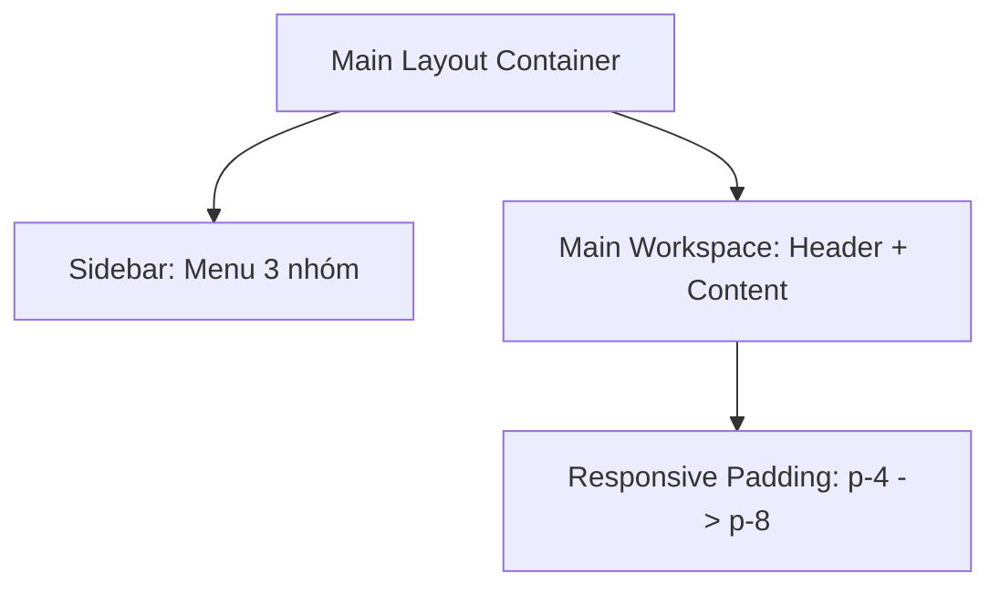

# 🎨 Kế Hoạch Thiết Kế Lại Bố Cục & Layout Frontend (Layout Redesign Plan)

Tài liệu này đề xuất và thiết kế lại toàn bộ bố cục, layout của hệ thống frontend nhằm cải thiện tính khoa học, tối ưu hóa không gian hiển thị, đồng thời nâng tầm trải nghiệm người dùng (UX) và giữ vững phong cách thiết kế hiện đại Glassmorphism + Cyberpunk.

---

## 🎯 1. Mục Tiêu Thiết Kế Lại

1. **Khắc phục bố cục xếp dọc (Vertical Stack Layout)**: Tránh việc các form cấu hình và màn hình log bị xếp chồng lên nhau quá dài trên màn hình máy tính (Desktop/Laptop), gây lãng phí không gian chiều ngang và bắt người dùng phải cuộn trang liên tục.
2. **Phân nhóm thông tin thông minh**: Gom nhóm các tính năng có sự tương đồng (như cài đặt API, cấu hình AI, quản lý hệ thống) vào các hệ thống **Tabs** hoặc **Sidebar con**.
3. **Cải tiến Sidebar điều hướng chính**: Gom nhóm 11 mục menu hiện tại thành các danh mục con (Categories) giúp thanh menu gọn gàng, trực quan và chuyên nghiệp.
4. **Đảm bảo tính phản hồi (Responsive)**: Chuyển đổi mượt mà giữa bố cục 2 cột (trên màn hình lớn Desktop) và bố cục 1 cột (trên màn hình nhỏ Tablet/Mobile).
5. **Tuyệt đối bảo toàn logic**: Chỉ sắp xếp lại cấu trúc JSX, CSS class (Tailwind CSS v4) và các thẻ bao bọc, giữ nguyên 100% logic nghiệp vụ (`useState`, custom hooks, events).

---

## 🗺️ 2. Bố Cục Chi Tiết Các Thành Phần

### 2.1. Layout Tổng Thể (App Layout & Workspace)

*   **Vấn đề hiện tại**:
    *   Thanh Sidebar điều hướng chứa 11 mục hiển thị dạng danh sách phẳng, quá dài và khó tập trung.
    *   Khu vực hiển thị nội dung chính sử dụng padding cứng `p-8`, làm thu hẹp không gian hiển thị của các bảng dữ liệu trên màn hình vừa và nhỏ.
*   **Giải pháp thiết kế mới**:
    *   **Sidebar Gom Nhóm (Grouped Navigation)**: Phân bổ 11 mục menu thành 3 nhóm rõ ràng:
        1.  **📊 HOẠT ĐỘNG CHÍNH (Core Operations)**: *Tổng quan (Dashboard), Cào Video, Upload File Xử Lý, Live Restream, Sáng Tạo AI.*
        2.  **⚙️ QUẢN LÝ DỮ LIỆU (Management)**: *Lịch sử, Khám phá Hot Trend, Lịch Đăng Bài.*
        3.  **🔧 CẤU HÌNH & KẾT NỐI (System)**: *Tài khoản MXH, Quản lý Proxy, Cấu hình.*
    *   **Responsive Padding**: Thay thế `p-8` bằng `p-4 sm:p-6 lg:p-8` giúp giao diện thông thoáng hơn trên thiết bị nhỏ.



---

### 2.2. Trang Tổng Quan (Dashboard)

*   **Vấn đề hiện tại**: Các KPI card khá đơn điệu, các phần biểu đồ và danh sách hoạt động gần đây xếp chồng không có tính năng lọc.
*   **Giải pháp thiết kế mới**:
    *   **KPI Sparklines**: Tích hợp các biểu đồ nhỏ (sparkline) chạy ngầm dưới nền các KPI Cards để hiển thị nhanh xu hướng (Ví dụ: số video cào được tăng/giảm trong ngày).
    *   **Filter Timeframe**: Thêm bộ lọc khoảng thời gian nhanh (Hôm nay, 7 ngày qua, 30 ngày qua) cho biểu đồ năng suất hoạt động.
    *   **Activity Feed**: Thiết kế lại "Hoạt động gần đây" với icon trạng thái sinh động hơn và thanh cuộn ẩn tinh tế.

---

### 2.3. Trang Cào Video (Phase 1: Crawler)

*   **Vấn đề hiện tại**: Form nhập URL ở trên và Log hoạt động ở dưới. Khi log chạy dài, người dùng phải cuộn xuống dưới cùng để xem và cuộn lên để bấm nút điều khiển.
*   **Giải pháp thiết kế mới**:
    *   Sử dụng **Bố cục 2 Cột Linh Hoạt (Split Screen Layout)** trên màn hình từ `lg` (min-width: 1024px) trở lên.
    *   **Cột Trái (40% - Control Panel)**:
        *   Form nhập URL Profile/Video (Dùng Textarea tự co giãn).
        *   Thanh tiến trình (Progress Bar) dạng gradient tích hợp hiệu ứng xung động neon.
        *   Nút bấm "Bắt đầu Cào" nổi bật với gradient neon.
    *   **Cột Phải (60% - Realtime Console)**:
        *   Màn hình Terminal Log được cố định chiều cao tương ứng với cột trái (ví dụ: `h-[500px]` hoặc tự động khớp chiều cao).
        *   Thanh tiêu đề giả lập cửa sổ macOS hoặc Terminal với các nút điều khiển, tiêu đề file `crawler.sh` hiển thị sáng bóng.

```
+-------------------------------------------------------------------------+
|                              Header (Cào Video Douyin)                  |
+------------------------------------+------------------------------------+
|  CỘT TRÁI: ĐIỀU KHIỂN & CẤU HÌNH   |  CỘT PHẢI: CONSOLE LOG LIVE        |
|  - Tiêu đề & Hướng dẫn             |  - Terminal log (Console window)   |
|  - Ô nhập link (Textarea)          |  - Chiều cao cố định, auto scroll  |
|  - Nút Bắt đầu Cào                 |  - Hiển thị log chi tiết dạng dòng |
|  - Progress Bar (Hiển thị khi chạy)|                                    |
+------------------------------------+------------------------------------+
```

---

### 2.4. Trang Xử Lý File & Render (Phase 2: Processor)

*   **Vấn đề hiện tại**: Form cấu hình rất đồ sộ (Chọn cấu hình, đường dẫn, chọn giọng nói, cấu hình phụ đề, cấu hình watermark) làm trang dài hàng ngàn pixel.
*   **Giải pháp thiết kế mới**:
    *   Sử dụng **Bố cục 2 Cột Linh Hoạt (Split Screen Layout)**.
    *   **Cột Trái (60% - Cấu hình nâng cao)**:
        *   *Phía trên*: Banner chọn mẫu cấu hình có sẵn và nút lưu cấu hình nhanh.
        *   *Phần chính*: Form cấu hình được tổ chức dưới dạng **Tabs** (Sử dụng state nội bộ của trang để chuyển đổi mượt mà):
            *   **📁 Nguồn & Giọng đọc**: Ô nhập đường dẫn video, quét thư mục, chọn giọng nói AI, chỉnh âm lượng.
            *   **📝 Phụ đề (Subtitle)**: Tích hợp `SubtitleConfigPanel` với các thanh trượt font size, chọn font, màu sắc, kiểu hiển thị.
            *   **🖼️ Watermark / Logo**: Tích hợp `WatermarkConfigPanel` điều chỉnh vị trí X/Y, độ mờ, tải ảnh lên.
            *   **⚡ Hiệu ứng Video (Video FX)**: Gom các checkbox lật video, zoom, cân bằng màu, khử nhiễu, điều chỉnh tần số âm thanh (pitch).
    *   **Cột Phải (40% - Tiến trình & Trình diễn)**:
        *   *Phía trên*: Hiển thị tiến trình Render hiện tại (Progress Bar lớn, các thông số FPS dự kiến).
        *   *Phía dưới*: Console Log của tiến trình FFMPEG chạy realtime với font chữ mono cyan đẹp mắt.
        *   *Tùy chọn*: Thêm một khung xem trước vị trí Watermark giả lập (Mockup Preview) để người dùng hình dung vị trí Watermark X/Y.

```
+-------------------------------------------------------------------------+
|                        Header (Xử Lý Video Nội Bộ)                      |
+------------------------------------+------------------------------------+
|  CỘT TRÁI: CẤU HÌNH CHI TIẾT (60%) |  CỘT PHẢI: TRÌNH DIỄN & LOG (40%)  |
|  [ Banner Chọn / Lưu Cấu Hình ]    |  - Progress Bar Render (Chạy sóng) |
|  +------------------------------+  |  - Cửa sổ Log FFMPEG               |
|  | Tab 1: Nguồn & Giọng AI      |  |  - Mockup Vị Trí Watermark         |
|  | Tab 2: Thiết Lập Phụ Đề      |  |                                    |
|  | Tab 3: Cấu Hình Watermark    |  |                                    |
|  | Tab 4: Hiệu Ứng Video        |  |                                    |
|  +------------------------------+  |                                    |
+------------------------------------+------------------------------------+
```

---

### 2.5. Trang Cấu Hình Hệ Thống (Settings)

*   **Vấn đề hiện tại**: Một form dọc dài với hàng chục ô nhập API key, cookie, proxy, gây cảm giác ngợp cho người dùng.
*   **Giải pháp thiết kế mới**:
    *   Chuyển đổi form cài đặt thành dạng **Tabs Điều Hướng Thần Tốc (Internal Settings Tabs)** với Sidebar phụ (hoặc Top Tab bar):
        1.  **🔑 API & AI Keys**: Quản lý API Key cho Gemini, OpenAI, Claude, Groq, xAI và cài đặt luồng đồng thời (Concurrency).
        2.  **🎙️ Giọng Nói (TTS)**: Lựa chọn nhà cung cấp TTS mặc định (Edge-TTS, FPT.AI, ElevenLabs) và nhập API Key tương ứng.
        3.  **🌐 Trình Duyệt & Proxy**: Cấu hình Cookie Douyin (có thông tin hiển thị trạng thái cookie), cấu hình GPM Login API, HTTP Proxy.
        4.  **🖥️ Tăng Tốc & Giám Sát**: Bật/tắt tăng tốc GPU, cấu hình tự động quét Shadowban (Health Check).

---

## 🛠️ 3. Kế Hoạch Triển Khai (PDCA - Steps)

1.  **Bước 1 (PLAN)**: Đánh giá mã nguồn hiện tại của các file mục tiêu, đánh dấu các biến state và hàm handle quan trọng cần bảo tồn.
2.  **Bước 2 (DO - Cơ sở hạ tầng)**:
    *   Thêm các định nghĩa CSS hoặc màu sắc nếu cần thiết vào `frontend/src/index.css`.
3.  **Bước 3 (DO - Thiết kế lại Sidebar & Layout chung)**:
    *   Chỉnh sửa `frontend/src/components/Sidebar.jsx` để gom nhóm menu.
    *   Cập nhật `frontend/src/App.jsx` để điều chỉnh padding responsive của thẻ `<main>`.
4.  **Bước 4 (DO - Tái cấu trúc các Trang)**:
    *   Cập nhật `frontend/src/pages/Phase1Crawler.jsx` sang bố cục 2 cột.
    *   Cập nhật `frontend/src/pages/Phase2Processor.jsx` sang bố cục 2 cột + Tabs cấu hình.
    *   Cập nhật `frontend/src/pages/Settings.jsx` sang bố cục chia Tabs.
5.  **Bước 5 (CHECK - Kiểm thử toàn diện)**:
    *   Chạy thử ứng dụng và kiểm tra chức năng: Cào thử link Douyin, Render thử video bằng profile cũ, Lưu profile mới, Validate API Key trong Settings.
    *   Đảm bảo không có lỗi render do thiếu biến hoặc gọi hàm sai.
6.  **Bước 6 (ACT - Hoàn thiện)**:
    *   Tối ưu hóa các hiệu ứng hover, transition, đảm bảo tốc độ đạt 60fps và giao diện cực kỳ mượt mà.
